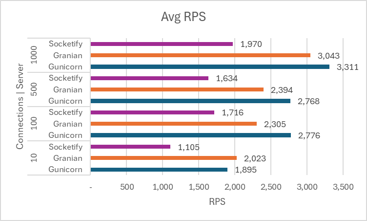
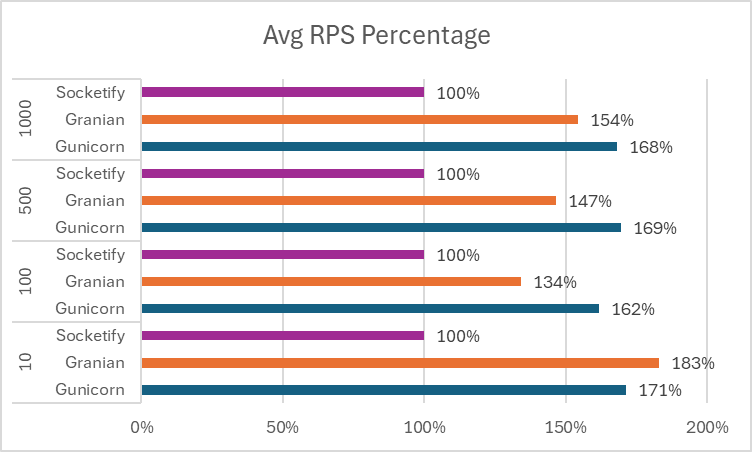

# LOAD TEST RESULT

## Request Per Second (RPS)

**Average Request per Second**



**Average Request per Second by Minimum RPS as Benchmark**



**Full Table**

| Connection | Server	 | 1%	| 2.50%	| 50%	|97.50%	| Avg	| Stdev	|Min  |
| -----------|-----------|-----:|------:|------:|------:|------:|------:|----:|
| 10         | Gunicorn  |1602	|1602	|1931	|2007	|1894.5	|114.6	|1602 |
|            | Granian   |1056	|1056	|2101	|2475	|2023	|466.76	|1056 |
|            | Socketify |761	|761	|1056	|1454	|1105.2	|217.69	|761  |
| 100        | Gunicorn  |2335	|2335	|2809	|3125	|2775.6	|245.02	|2334 |
|            | Granian   |1906	|1906	|2127	|3221	|2304.5	|369.47	|1906 |
|            | Socketify |1330	|1330	|1704	|1963	|1715.9	|211.47	|1330 |
| 500        | Gunicorn  |2195	|2195	|2743	|3519	|2768	|395.17	|2195 |
|            | Granian   |1855	|1855	|2131	|3003	|2394.1	|438.08	|1855 |
|            | Socketify |1004	|1004	|1612	|1939	|1633.8	|247.84	|1004 |
| 1000       | Gunicorn  |1431	|1431	|3377	|3865	|3311.4	|659.96	|1431 |
|            | Granian   |1714	|1714	|3213	|3379	|3042.7	|464.1	|1714 |
|            | Socketify |990	|990	|2073	|2395	|1970	|416.78	|990  |

## Latency

**Full Table**

| Connection | Server	 | 1%	| 2.50%	| 50%	|97.50%	|Avg	|Stdev	|Max  |
| -----------|-----------|-----:|------:|------:|------:|------:|------:|----:|
| 10         | Gunicorn	 | 1	| 4	    | 10	|11	    |4.78	|2.66	|19   |
|            | Granian	 | 2	| 3	    | 14	|17	    |4.46	|3.53	|76   |
|            | Socketify | 3	| 7	    | 23	|28	    |8.54	|5.67	|99   |
| 100        | Gunicorn	 | 2	| 15	| 107	|118	|35.45	|38	    |190  |
|            | Granian	 | 9	| 25	| 174	|197	|42.74	|45.56	|252  |
|            | Socketify | 15	| 53	| 131	|151	|57.72	|28.1	|218  |
| 500        | Gunicorn	 | 16	| 47	| 781	|823	|176.96	|233.89	|847  |
|            | Granian	 | 60	| 147	| 725	|749	|204.2	|166.86	|889  |
|            | Socketify | 153	| 281	| 668	|773	|303.48	|119.78	|999  |
| 1000       | Gunicorn	 | 46	| 127	| 1522	|1658	|295.27	|381.41	|1845 |
|            | Granian	 | 137	| 239	| 773	|828	|323	|194.49	|1280 |
|            | Socketify | 319	| 449	| 1027	|1192	|499.63	|174.12	|1384 |


# RUNNING THE TEST

## Docker Command

>Build and Run Docker Container for Gunicorn
```bash
docker build -t gunicorn -f Dockerfile_gunicorn .
docker run --name container_gunicorn -p 8000:8000 -e BIND="0.0.0.0:8000" -e WEB_CONCURRENCY="8" -e LOG_LEVEL="CRITICAL" gunicorn
```

>Build and Run Docker Container for Granian
```bash
docker build -t granian -f Dockerfile_granian .
docker run --name container_granian -p 8001:8000 granian
```

>Build and Run Docker Container for Socketify
```bash
docker build -t socketify -f Dockerfile_socketify .
docker run --name container_socketify -p 8002:8000 socketify
```

## Load Test Command
>Install autocannon
```bash
npm install autocannon -g
```

>Run Load Test for Gunicorn
```bash
autocannon -c 100 -d 10 -W [-c 1 -d 2] http://127.0.0.1:8000/
```

>Run Load Test for Granian
```bash
autocannon -c 100 -d 10 -W [-c 1 -d 2] http://127.0.0.1:8001/
```

>Run Load Test for Socketify
```bash
autocannon -c 100 -d 10 -W [-c 1 -d 2] http://127.0.0.1:8002/
```